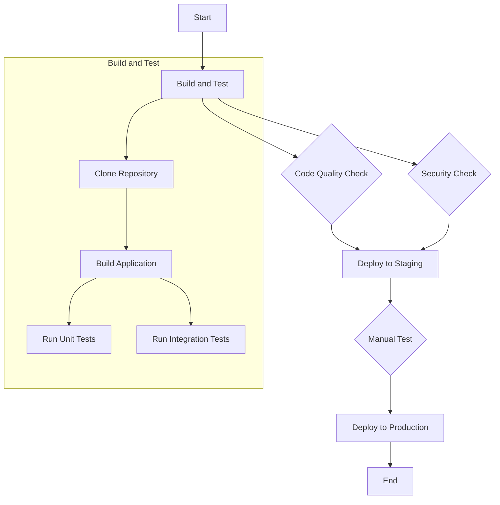

```mermaid
graph TD
    A[Start] --> B[Build and Test]
    B --> C{Code Quality Check}
    B --> D{Security Check}
    C --> E[Deploy to Staging]
    D --> E
    E --> F{Manual Test}
    F --> G[Deploy to Production]
    G --> H[End]

    subgraph "Build and Test"
        B1[Clone Repository]
        B2[Build Application]
        B3[Run Unit Tests]
        B4[Run Integration Tests]
        B --> B1
        B1 --> B2
        B2 --> B3
        B2 --> B4
    end
```


```mermaid


graph TD
    
    B1[Something]
    B2[Something2]
    B1 --> B2{Oh}