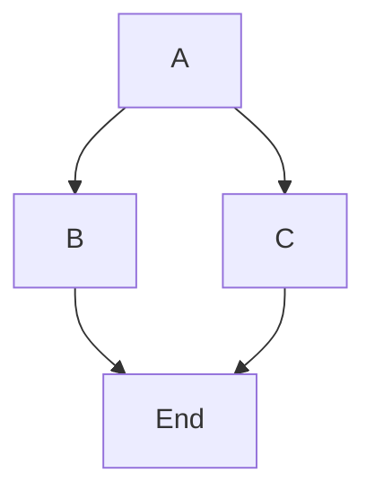
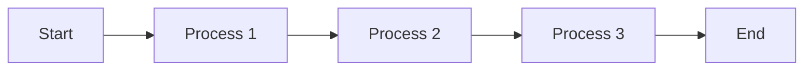

<div style="max-width: 50%; margin:auto;>

        ```mermaid
        graph TD
            A[Start] --> B[Build and Test]
            B --> C{Code Quality Check}
            B --> D{Security Check}
            C --> E[Deploy to Staging]
            D --> E
            E --> F{Manual Test}
            F --> G[Deploy to Production]
            G --> H[End]

            subgraph "Build and Test"
                B1[Clone Repository]
                B2[Build Application]
                B3[Run Unit Tests]
                B4[Run Integration Tests]
                B --> B1
                B1 --> B2
                B2 --> B3
                B2 --> B4
            end
        ```


        ```mermaid


        graph TD
            
            B1[Something]
            B2[Something2]
            B1 --> B2{Oh}

        ```
</div>